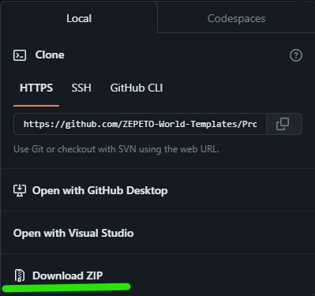
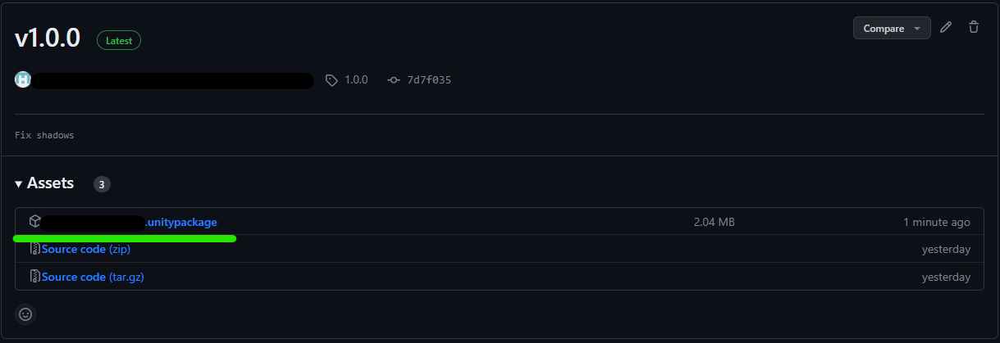
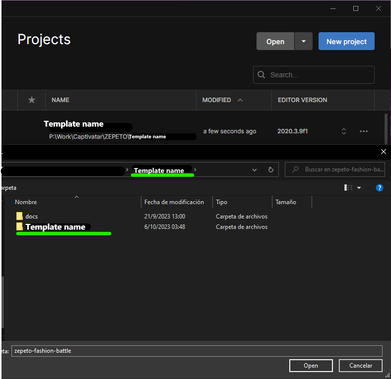
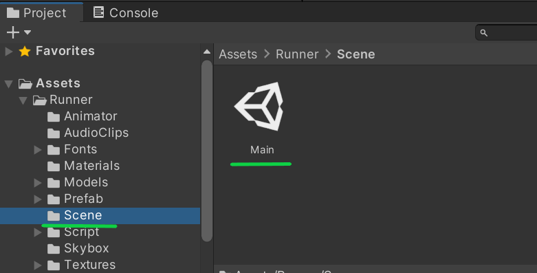
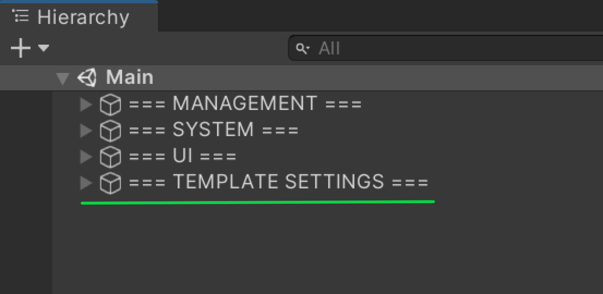
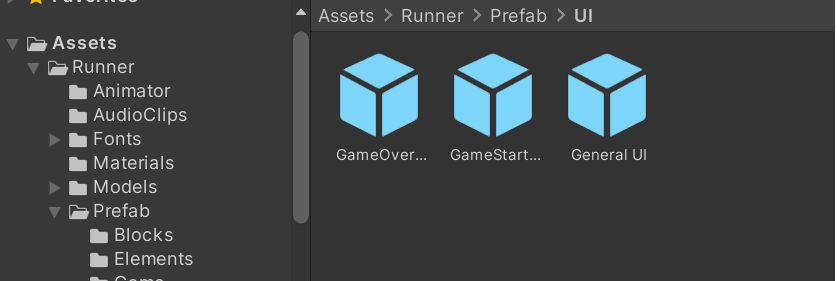

# Runner-Template

## 📢 About
Nice to meet you Creators! 👋 Welcome to Runner template guide!  
With Runner you can create amazing worlds to play with your friends!  
Now, are you ready to start?  

## Overview

In this endless runner game, players take on the role of a character racing through dynamic, obstacle-filled environments. The goal is to collect as many items as possible while dodging various obstacles and pitfalls.   

## ❓ How to create with Runner template
:wrench: Installation and settings

- If you haven't install the Zepeto World you can check how to do it <a href="https://docs.zepeto.me/studio/reference/installation_and_settings">Here!</a>

- Once you have installed Zepeto, you have to pull this repository and you can do it in 3 ways
  - [Cloning it](#cloning-the-project)
  - [Downloading it](#downloading-the-project)
  - [By Unitypackage](#getting-it-from-the-releases-section)

### Cloning the project

First we go to the [Code] button and click it.

 </img> 

Then click on the icon to copy the link of the repository (make sure that you are on the https tab) or copy it manually.

 </img> 

Once you have it, using your your preferred software (in this case we are using <a href="https://git-fork.com/" target="_blank"> Fork</a>) click on "File->Clone" or press "Ctrl + N" to clone.

 </img> 

Here we fill the URL tab and set the folder where you want to save it and press clone.

 </img> 

Once it clones the project you can open it from Unity Hub.  

### Downloading the project

Click on the same [Code] button but instead of clicking on the link, click on download zip

 </img> 

Then extract the files and open it with Unity.  

### Getting it from the releases section

Go to the releases section or click in the latest release.

 </img> 

Then click on the file ".unitypackage" and import it in a new project of Unity!

 </img> 

> 💡 Enjoy and start creating with the Template! :tada:
 

## ❓ FAQ

 
 <h3>How to open the project</h3> 

Select the template folder and it will open the project.
 </img>

 
 To open a Unity project for the first time, follow these steps:

1. Launch Unity Hub.
2. In Unity Hub, click on the "Projects" tab on the left side.
3. Click on Add: If your project is not already listed, click on the "Add" button to add your project to the list. Navigate to the folder where your Unity project is located and select the folder. Click "Open" to add the project to Unity Hub.
4. Select Project: Once your project is added to the list, click on it to select it.
5. Wait for Unity to Load: Unity will now open your project. This may take some time depending on the size of your project and your computer's performance.
6. Project Opened: Once Unity has finished loading, your project will be opened and ready for you to work on.

 
 <h3>How to play</h3> 
 
Before you press play to test the template you have to open the scene.  

 
 To play the game template in Unity, follow these steps: 

1. Open the Scene: First find the scene in the next folder and open it.
 </img>  
2. Play the Template: then you can press [Play] to test the template.

 

<h3> How to change variables</h3> 
 

To make changes in the game you can go in the Hierarchy and select the "Managers" folder there are the most customizables settings for the template.

 </img>
 

 
 To change variables in Unity, follow these steps:

1. Open the Hierarchy: In the Unity Editor, locate and click on the "Hierarchy" tab at the top of the screen.
2. Select the "Managers" Folder: In the Hierarchy window, find and click on the "Managers" folder. This folder contains the most customizable settings for the template.
3. Modify Variables:  With the "Managers" folder selected, you can now modify the variables and settings for the template as needed.
4. Save Changes: After making your changes, remember to save the scene by clicking on "File" > "Save Scene" in the Unity Editor.

  

## 🔨 Tools
 

 
 Hierarchy: 
 

General structure of the template. The following scripts must be included and active in the scene since they are singletons.

 </img>   
 

 
 GameManagerRunner: 
 
 This script is the main control of the game.
Contains the public spawn reference of the player and the state of the game.
Internally it manages the Start, End and Reset states of the game.

 </img>     
  

 
 LevelGenerator: 
 
This script is responsible for generating the initial state of the level and controlling the generation of new blocks through the use of Block Pools. Contains the public references in a list of block pools, as well as the initial block reference and its generation point.

Additionally, you can adjust how often (in seconds) the level of difficulty of the game and its speed are raised respectively.

 </img>    
 

 
 BlockPool: 
 
Block pools are an implementation of a design pattern to achieve better performance. These contain the reference of the block type that they can use. To implement new blocks it is necessary to create these objects (Block Pools) with the reference to the new block and assign this pool to the LevelGenerator as can be seen in the template.

 </img>
  

 
 PointManager:
 
 Script in charge of managing the addition and reset of points in the game.

 </img>
 

 
 TimeManager:
 
 Script in charge of managing the running and reset of the game time.

 </img>
 

 
 UIManager:
 
 This script is in charge of updating the information on the screen regarding both the elapsed time and the points achieved throughout the game. It is also responsible for displaying the start and end of game panels. Contains the respective references.

 </img>
 

 
 AudioManager:
 
This script is in charge of triggering the sounds and contains the references of the AudioSource (Included as a component of itself) and of a sound effect.

 </img> 
 

## 🚧 Builds

<h3>Block:</h3>

Main prefab block. It contains a script (MoveBlock) that defines its speed and whether it moves or not.

It is also possible to modify their level of difficulty so that the level generator decides to add them according to their configuration.

 </img>                  
 

<h3>SpawnBlock:</h3>

 It's an empty game object, which goes to the end of the block. It has a Collider Trigger to know when the player has finished passing over it and notify the LevelGenerator to add a new block as well as detect the collision with the end of the level to remove it.

 </img> 
</img> 
</img> 
 

<h3>Point Target:</h3> 

Prefab which adds points when colliding with the player, contains the script PointTargetRunner. Your collider must be trigger
 </img> 
</img> 
 

-----------------------------
| Name              | Functionality                             |
| ----------------- | ----------------------------------------- |
| `Points Value`    | Number of points to be scored.            |
| `Particle System` | Effect of particulates when collisinating |
                    
 

<h3>Obstacles:</h3> 

A game object that upon collision with the player triggers the game over event. Your collider must be trigger. Contains the script: GameOverRunner.  Add it to the scene and then add the object you want as a child of the prefab.

</img> 
</img> 
 

</h3> Obstacles UpDown:</h3>

 A game object that moves up and down with a random speed between maximum and minimum passing speed. Your collider must be trigger. Contains 2 script: GameOverRunner, UpDownMovement.

</img> 
</img> 

|             |                                                          |
| ----------- | -------------------------------------------------------- |
| `Max Speed` | Maximum speed of movement that the object could acquire  |
| `Min Speed` | Minimum speed of movement that the object could acquire  |
| `Height`    | Maximum height you can climb from your starting position |

## :point_right: You can easily modify this:

**LevelGenerator:**
This script is responsible for generating the initial state of the level and controlling the generation of new blocks through the use of Block Pools. Contains the public references in a list of block pools, as well as the initial block reference and its generation point.

Additionally, you can adjust how often (in seconds) the level of difficulty of the game and its speed are raised respectively.

 </img>    
 

**To modify the difficultyLevelsTimeLimits variable in Unity, you can follow these steps:**
1. Select the LevelGenerator GameObject : Open your Unity project and select the GameObject that contains the script with the difficultyLevelsTimeLimits variable you want to modify.
2. Locate the Script in the Inspector: In the Inspector window, find the component or script that contains the difficultyLevelsTimeLimits variable. Make sure the script is attached to the selected GameObject in the Hierarchy.
3. Expand the Variable: Once you've found the script, you should see the difficultyLevelsTimeLimits variable. It may be in a list.
4. Modify the Values: Click on the difficultyLevelsTimeLimits field to expand it if necessary. You'll see a list of numbered values. You can click on each value to edit it directly in the Inspector.
5. Adjust the Times: Modify the numerical values as needed. These values represent the times when the difficulty level will go up.
6.  Save the Changes.
 

**To modify the levelSpeedByDifficulty variable in Unity, you can follow these steps:**
1. Select the LevelGenerator GameObject: Open your Unity project and select the GameObject that contains the script with the levelSpeedByDifficulty variable you want to modify.
2. Locate the Script in the Inspector: In the Inspector window, find the component or script that contains the levelSpeedByDifficulty variable. Make sure the script is attached to the selected GameObject in the Hierarchy.
3. Expand the Variable: Once you've found the script, you should see the levelSpeedByDifficulty variable. It may be in a list.
4. Modify the Values: Click on the levelSpeedByDifficulty field to expand it if necessary. You'll see a list of numbered values. You can click on each value to edit it directly in the Inspector.
5. Adjust the Speed: Modify the numerical values as needed. These values represent  the speed levels that accompany each difficulty jump.
6.  Save the Changes.
 

**To create new blocks and add them to the blockPools variable, modify existing blocks, or change their order, follow these steps:**
1. Access the Script LevelGenerator.
2.  Define a New Block: To create a new block, define a new prefab or game object that represents your block. This could be a platform, obstacle, or any other element in your game.
3. Add the New Block to the Scene: Drag and drop the new block prefab into your scene to place it where you want it to appear during gameplay.
4. Modify the blockPools Variable: In the Inspector, find the blockPools variable in your script. This variable should be an array or list that holds references to all the block prefabs.
5.  Add the New Block to the blockPools Variable: Click the "+" button in the Inspector next to the blockPools variable to add a new element to the array or list. Drag the new block prefab from the Hierarchy or Project window into the new slot in the blockPools variable.
6.  Modify Existing Blocks: To modify existing blocks, select the block prefab in the Hierarchy or Project window. Make the desired changes to the block's properties, such as its size, color, or behavior.
7. Change the Order of Blocks: To change the order of blocks in the blockPools variable, simply drag and drop the block prefabs within the array or list to rearrange them as needed.
8.  Test Your Changes: Play your game in the Unity Editor to test the new blocks, modifications, and order changes. Adjust as necessary to achieve the desired gameplay experience.
9. Save Your Scene and Project: Once you're satisfied with your changes, save your scene and project in Unity to preserve your modifications.

<h3>UI Prefabs</h3>
You can edit every panel of each part of the game from their own prefab.
You can found them in the project folder.
 </img>  

   To modify UI prefabs in Unity, follow these steps:
1. Locate the UI prefab you want to modify. You can find prefabs in the project folder under the "Prefabs" directory or in a specific folder for UI elements.
2. Double-click on the UI prefab to open it in the Prefab Editor.
3. In the Prefab Editor, you can modify the UI elements as needed. This may include changing text, images, layouts, or adding/removing components.
4. Once you have made your modifications, save the prefab by clicking the "Apply" button in the Prefab Editor.
5. To apply the changes to instances of the prefab in your scene, select each instance and click the "Apply" button in the Inspector window.
6. Test your changes in Play mode to ensure they work as expected.
7. If you need to make further modifications, repeat the above steps.

