# Runner-Template
## 📢 About
Nice to meet you Creators! 👋 Welcome to Runner template guide!
With Runner you can create amazing worlds to play with your friends!
Now, are you ready to start?

## ❓ How to create with Runner template
:wrench: Installation and settings
- Download Unity Hub and Unity 2020.3.9f1 version. ([Download](https://unity.com/releases/editor/archive))
- Pull the repository.

> 💡 Enjoy and start creating with Runner Template! :tada:

## 🔨 Tools
- **GameManagerRunner**: This script is very important for the functioning of the Runner template.
Check that it is in scene. This script instantiates all the singletons that Runner
needs, it also loads the variables of the singleton instances, that's why we pass all
the data here.
</img>    
-----------------------------
Name |  Functionality
------------- | -------------
`Blocks`  | Array of prefab blocks that will generate the level, these will be set randomly.
`First Block` | The first block that starts the level is the only one active in the scene at the beginning
`Last Block` | Last Block which is updated to know where to instantiate the next one.
`Game Over Prefab UI`| Prefab of the game over screen. it appears when we collide with an obstacle..
`Parent UI`| The parent where the GameOverPrefabUI is to be instantiated, must have a canvas.              

## 🚧 Builds
- **Block:** Prefab that is instantiated to generate the runner level. contains 2 scripts: MoveBlock, BlockLevel.
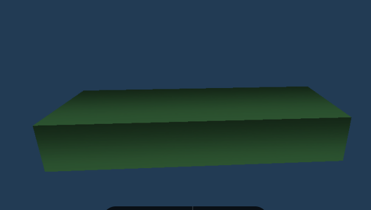</img>
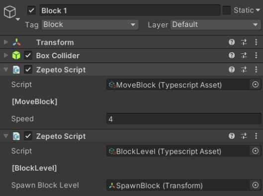</img>
Name| Functionality  
------------ | ------------ 
`Speed`  | Speed at which the block will move towards the player.
`Spawn Block Level`  | Transform from where the next Block is to be instantiated.
                    

- **SpawnBlock:** It is an empty game object, which goes at the end of the block and its transform will be passed to BlockLevel, to know where to instantiate the next block. It also has a collider Trigger to know when the player has finished passing over it, and instantiate the next block. **It must also be the first child of block.**
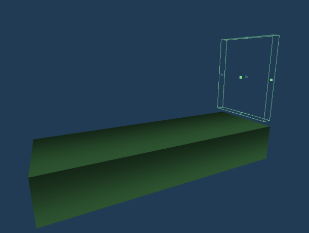</img>
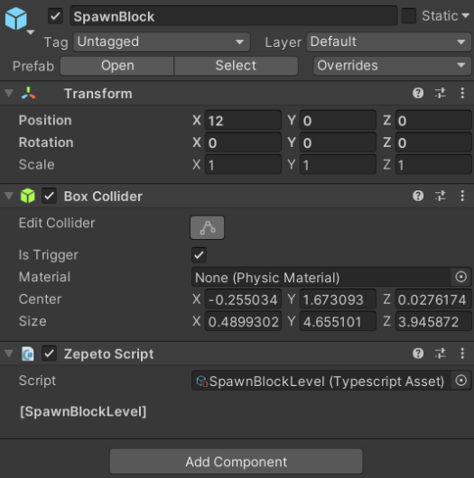</img>
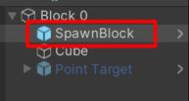</img>
- **Point Target:** Prefab which adds points when colliding with the player, contains the script PointTargetRunner. Your collider must be trigger
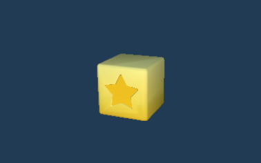</img>
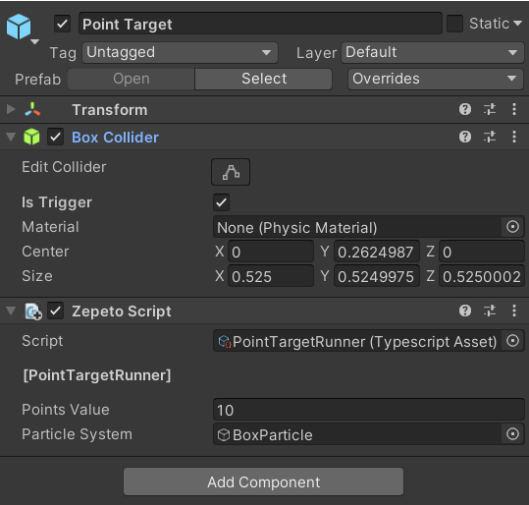</img>
Name| Functionality  
------------ | ------------ 
`Points Value`  | Number of points to be scored.
`Particle System`  | Effect of particulates when collisinating
                    
- **Obstacles:** A game object that upon collision with the player triggers the game over event. Your collider must be trigger. contains the script: GameOverRunner Add it to the scene and then add the object you want as a child of the prefab.
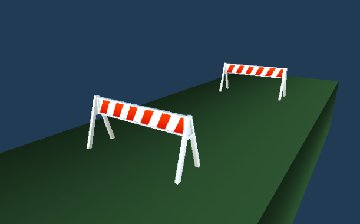</img>
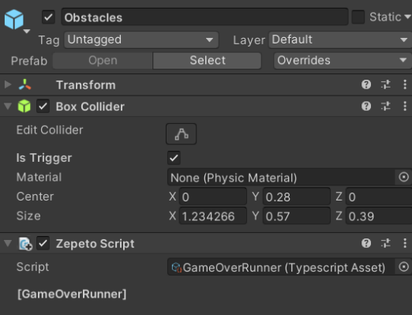</img>
- **Obstacles UpDown:** A game object that moves up and down with a random speed between maximum and minimum passing speed. Your collider must be trigger. contains 2 script: GameOverRunner, UpDownMovement
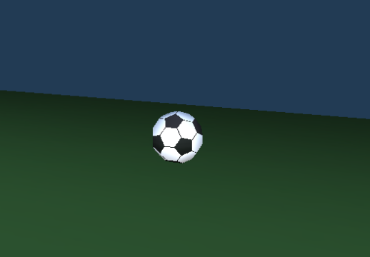</img>
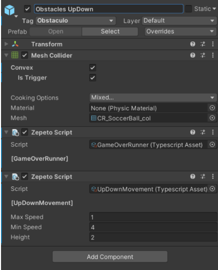</img>

|   |   |
| ------------ | ------------ |
| `Max Speed`   |  Maximum speed of movement that the object could acquire
| `Min Speed`   |  Minimum speed of movement that the object could acquire
| `Height`   |  Maximum height you can climb from your starting position

