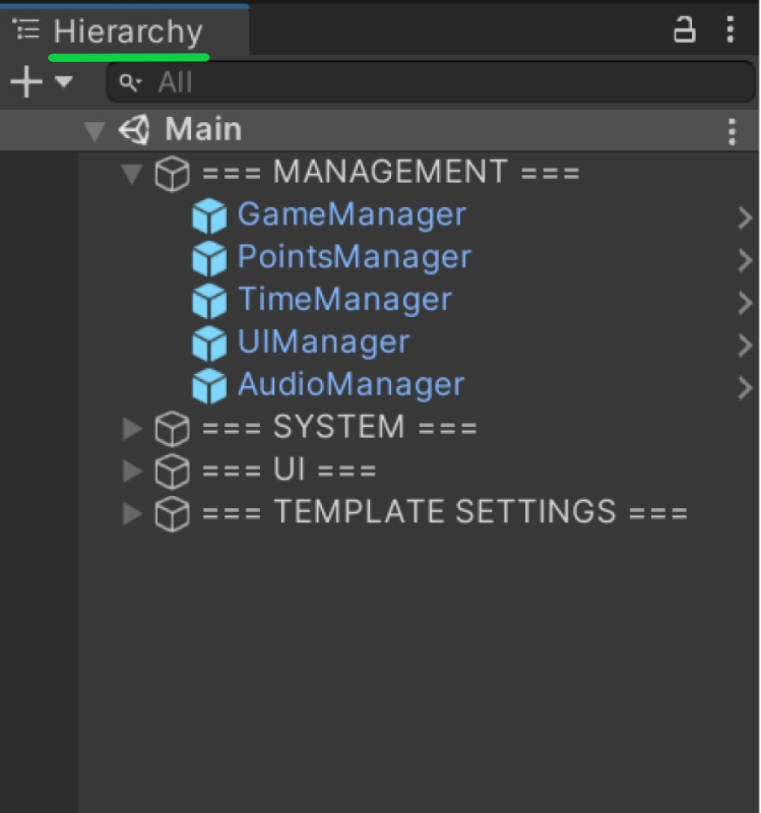
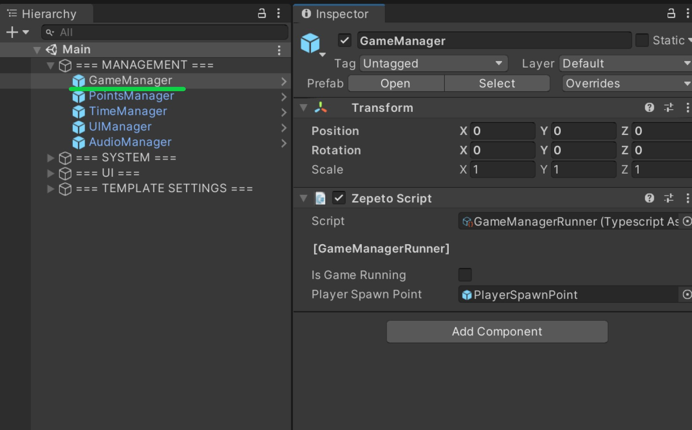
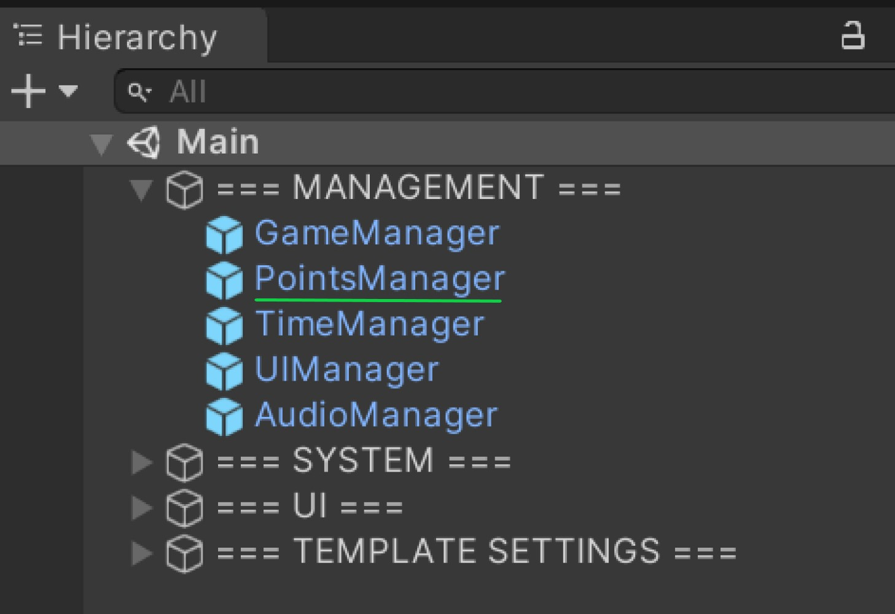

# Runner-Template
## 📢 About
Nice to meet you Creators! 👋 Welcome to Runner template guide!
With Runner you can create amazing worlds to play with your friends!
Now, are you ready to start?

## ❓ How to create with Runner template
:wrench: Installation and settings
- Download Unity Hub and Unity 2020.3.9f1 version. ([Download](https://unity.com/releases/editor/archive))
- Pull the repository.

> 💡 Enjoy and start creating with Runner Template! :tada:

## 🔨 Tools
- **Hiterachy**: General structure of the template. The following scripts must be included and active in the scene since they are singletons.

</img>   

- **GameManagerRunner**: This script is the main control of the game.
Contains the public spawn reference of the player and the state of the game.
Internally it manages the Start, End and Reset states of the game.

</img>    

- **LevelGenerator**: This script is responsible for generating the initial state of the level and controlling the generation of new blocks through the use of Block Pools. Contains the public references in a list of block pools, as well as the initial block reference and its generation point.

Additionally, you can adjust how often (in seconds) the level of difficulty of the game and its speed are raised respectively.

</img>    

- **BlockPool**: Block pools are an implementation of a design pattern to achieve better performance. These contain the reference of the block type that they can use. To implement new blocks it is necessary to create these objects (Block Pools) with the reference to the new block and assign this pool to the LevelGenerator as can be seen in the template.

</img>  

- **PointManager**: Script in charge of managing the addition and reset of points in the game.

</img> 

- **TimeManager**: Script in charge of managing the running and reset of the game time.

</img> 

- **UIManager**: This script is in charge of updating the information on the screen regarding both the elapsed time and the points achieved throughout the game. It is also responsible for displaying the start and end of game panels. Contains the respective references.

</img> 

- **AudioManager**: This script is in charge of triggering the sounds and contains the references of the AudioSource (Included as a component of itself) and of a sound effect.

</img> 

## 🚧 Builds
- **Block:** Main prefab block. It contains a script (MoveBlock) that defines its speed and whether it moves or not.

It is also possible to modify their level of difficulty so that the level generator decides to add them according to their configuration.

</img>                 

- **SpawnBlock:** It's an empty game object, which goes to the end of the block. It has a Collider Trigger to know when the player has finished passing over it and notify the LevelGenerator to add a new block as well as detect the collision with the end of the level to remove it.

</img>
</img>
</img>
- **Point Target:** Prefab which adds points when colliding with the player, contains the script PointTargetRunner. Your collider must be trigger
</img>
</img>
-----------------------------
| Name              | Functionality                             |
| ----------------- | ----------------------------------------- |
| `Points Value`    | Number of points to be scored.            |
| `Particle System` | Effect of particulates when collisinating |
                    
- **Obstacles:** A game object that upon collision with the player triggers the game over event. Your collider must be trigger. contains the script: GameOverRunner Add it to the scene and then add the object you want as a child of the prefab.
</img>
</img>
- **Obstacles UpDown:** A game object that moves up and down with a random speed between maximum and minimum passing speed. Your collider must be trigger. contains 2 script: GameOverRunner, UpDownMovement
</img>
</img>

|             |                                                          |
| ----------- | -------------------------------------------------------- |
| `Max Speed` | Maximum speed of movement that the object could acquire  |
| `Min Speed` | Minimum speed of movement that the object could acquire  |
| `Height`    | Maximum height you can climb from your starting position |

